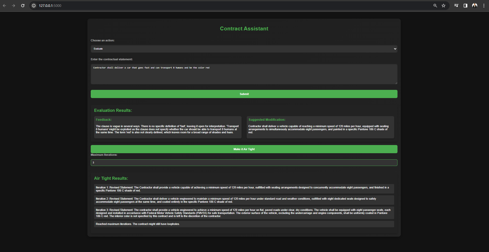

# Contract Assistant

## Application Screenshot

## Overview
Contract Assistant is a web-based tool designed to assist in the evaluation and modification of contractual statements. It leverages advanced language models to analyze contracts for potential ambiguities or loopholes, and suggests modifications to make them more airtight. Additionally, it can condense contract statements into more concise forms while retaining their legal accuracy and intent.

## Features
- **Evaluate Contract**: Analyzes contractual clauses for legal vulnerabilities and ambiguities, providing feedback and suggested modifications.
- **Condense Contract**: Condenses contract statements into shorter versions without losing essential details.
- **Make it Air Tight**: Iteratively refines contract statements based on provided feedback to make them legally sound and loophole-free. (Think feedback loop of self improving contract statements)

## How It Works
The application uses a Flask backend with integrated language models for processing and evaluating contract statements. Users interact through a web interface where they can input contractual clauses and receive evaluations or condensed versions of these clauses.

## Using the Application
1. Open the application in a web browser.
2. Select the desired action (Evaluate or Condense).
3. Enter the contractual statement in the provided text area.
4. Click 'Submit' to receive feedback or a condensed version of the statement.
5. For evaluations, use the 'Make it Air Tight' feature to iteratively refine the statement.